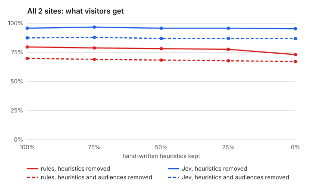
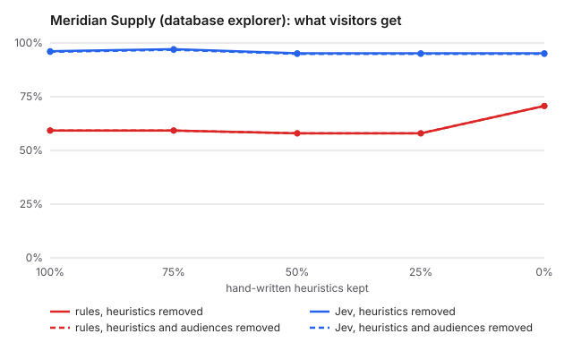
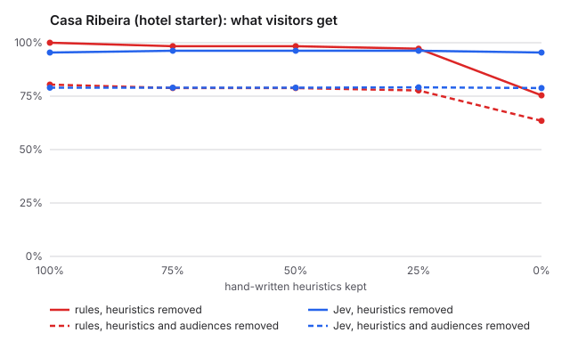

# Ablation follow-up F1: placement labels

> Registered after the main study (see [the main report](../report.md)) and reported separately; it never changes the main verdict. It adds region and salience labels for the explorer and the hotel and replays the main study's Jev recordings, so no new engine answers were sampled.
>
> Disclosure: one run happened by mistake before the registration was committed (a $0 dry run did not stop for confirmation). Only its one-line verdict (not-shown) was seen; the labels and the rule were not changed afterwards.

Generated 2026-10-01T11:52:50.371Z · engine jev-1.13.0 · seed 7 · Jev spent on recordings $0.39 (9,365,385 input tokens; this run $0.000)

## Verdict

**not-shown.** The pre-registered conditions are not met: gap without heuristics or audiences 19.8 points (needs >= 10); gap without heuristics 22.3 points; Jev invariants below 99% at 0% without audiences on explorer (91.3%), hotel (97.7%). Lead with cost, safety and explainability.

- Gap with heuristics removed (audiences kept), at 0%: 22.3 points
- Gap with heuristics and audiences removed, at 0%: 19.8 points
- Jev invariant pass rate at 0% without audiences: explorer 91.3%, hotel 97.7%

Rules fixed before the data was seen: gap = mean over the explorer and the hotel, at 0% kept with heuristics and audiences removed, of Jev's minus the rules' pooled decision accuracy. holds: gap >= 10 points and Jev invariants >= 99% on both sites; otherwise not-shown. The heuristics-only arm is reported but not part of the rule.

## Method

- **Two arms.** *Heuristics removed*: each site's hand-written heuristics are kept at 100%, 75%, 50%, 25% and 0%. *Heuristics and audiences removed*: the same, with every `audience` also removed. Descriptions (`what`, `not_for`, tags), defaults and business invariants (`mustInclude` / `mustExclude`) stay in both.
- **Seeded, nested removal.** Heuristics are dropped in an order fixed by seed 7; a heuristic kept at 25% is kept at every higher level. The restaurant is repeated with seed 1009.
- **Record once, replay.** Heuristics never reach the model, so within an arm Jev answers the same questions at every level. Jev is recorded once per site and arm (3 repeats) and replayed for every level.
- **Measurements.** *Raw accuracy*: labelled answers vs accepted values. *Decision accuracy*: labels scored against the final page after gating, defaults, invariants and fallbacks (what a visitor gets; for Jev this includes its rules fallback for uncalibrated kinds). *Invariants*: page properties every plan must satisfy.

## Situation space

| site | buckets | situations | fixtures | situations covered | sources | heuristics | audiences | description chars | naive rules for full coverage |
|---|---|---|---|---|---|---|---|---|---|
| explorer | 6 | 432 | 113 | 7 | 10 | 19 | 1 | 1,199 | 21,600 |
| hotel | 9 | 12,960 | 105 | 98 | 10 | 11 | 9 | 972 | 648,000 |

Situations are the product of declared labels per bucket (`language`: the languages the fixtures use); `unknown` is not counted, so this is a lower bound. Naive rules = situations × sources × 5 decisions.

## Meridian Supply (database explorer)

### heuristics removed

| kept | engine | relevance (raw) | relevance (decision) | all decisions | invariants |
|---|---|---|---|---|---|
| 100% | rules | 55.9% | 55.9% | 59.2% | 100.0% |
| 100% | jev-1.13.0 | 96.3% | 96.9% | 96.2% | 100.0% |
| 75% | rules | 55.9% | 55.9% | 59.2% | 87.0% |
| 75% | jev-1.13.0 | 96.3% | 96.9% | 97.1% | 100.0% |
| 50% | rules | 56.6% | 56.6% | 58.0% | 73.9% |
| 50% | jev-1.13.0 | 96.3% | 96.9% | 95.2% | 100.0% |
| 25% | rules | 56.6% | 56.6% | 58.0% | 60.9% |
| 25% | jev-1.13.0 | 96.3% | 96.9% | 95.2% | 100.0% |
| 0% | rules | 70.3% | 70.3% | 70.7% | 60.9% |
| 0% | jev-1.13.0 | 96.3% | 96.9% | 95.2% | 100.0% |

Invariant failures at 0% (rules):

- `ops-manager-monday`: hero is empty
- `executive-mobile`: hero is empty
- `executive-mobile`: inventory-risk present in secondary
- `role=ops-manager,device=desktop`: hero is empty
- `role=ops-manager,device=mobile`: hero is empty
- `role=executive,device=desktop`: hero is empty
- `role=executive,device=desktop`: inventory-risk present in aside
- `role=executive,device=mobile`: hero is empty
- … 1 more

### heuristics and audiences removed

| kept | engine | relevance (raw) | relevance (decision) | all decisions | invariants |
|---|---|---|---|---|---|
| 100% | rules | 55.9% | 55.9% | 59.2% | 100.0% |
| 100% | jev-1.13.0 | 96.6% | 96.6% | 95.9% | 91.3% |
| 75% | rules | 55.9% | 55.9% | 59.2% | 87.0% |
| 75% | jev-1.13.0 | 96.6% | 96.6% | 96.8% | 91.3% |
| 50% | rules | 56.6% | 56.6% | 58.0% | 73.9% |
| 50% | jev-1.13.0 | 96.6% | 96.6% | 94.9% | 91.3% |
| 25% | rules | 56.6% | 56.6% | 58.0% | 60.9% |
| 25% | jev-1.13.0 | 96.6% | 96.6% | 94.9% | 91.3% |
| 0% | rules | 70.3% | 70.3% | 70.7% | 60.9% |
| 0% | jev-1.13.0 | 96.6% | 96.6% | 94.9% | 91.3% |

Invariant failures at 0% (rules):

- `ops-manager-monday`: hero is empty
- `executive-mobile`: hero is empty
- `executive-mobile`: inventory-risk present in secondary
- `role=ops-manager,device=desktop`: hero is empty
- `role=ops-manager,device=mobile`: hero is empty
- `role=executive,device=desktop`: hero is empty
- `role=executive,device=desktop`: inventory-risk present in aside
- `role=executive,device=mobile`: hero is empty
- … 1 more

Invariant failures at 0% (jev-1.13.0):

- `ops-manager-monday`: briefing present in secondary
- `role=ops-manager,device=desktop`: briefing present in secondary

## Casa Ribeira (hotel starter)

### heuristics removed

| kept | engine | relevance (raw) | relevance (decision) | all decisions | invariants |
|---|---|---|---|---|---|
| 100% | rules | 100.0% | 100.0% | 100.0% | 100.0% |
| 100% | jev-1.13.0 | 100.0% | 100.0% | 95.4% | 99.4% |
| 75% | rules | 97.6% | 97.8% | 98.4% | 99.4% |
| 75% | jev-1.13.0 | 100.0% | 100.0% | 96.2% | 100.0% |
| 50% | rules | 97.6% | 97.8% | 98.4% | 99.4% |
| 50% | jev-1.13.0 | 100.0% | 100.0% | 96.2% | 100.0% |
| 25% | rules | 97.6% | 97.8% | 97.2% | 99.4% |
| 25% | jev-1.13.0 | 100.0% | 100.0% | 96.2% | 100.0% |
| 0% | rules | 86.3% | 89.2% | 75.4% | 98.2% |
| 0% | jev-1.13.0 | 100.0% | 100.0% | 95.4% | 99.4% |

Invariant failures at 0% (rules):

- `in-house-morning`: hero is empty
- `in-house-morning`: breakfast missing
- `in-house-rainy-evening`: today missing

Invariant failures at 0% (jev-1.13.0):

- `in-house-morning`: hero is breakfast

### heuristics and audiences removed

| kept | engine | relevance (raw) | relevance (decision) | all decisions | invariants |
|---|---|---|---|---|---|
| 100% | rules | 82.4% | 84.2% | 80.4% | 97.7% |
| 100% | jev-1.13.0 | 72.8% | 85.3% | 79.0% | 97.7% |
| 75% | rules | 80.0% | 82.0% | 78.8% | 97.1% |
| 75% | jev-1.13.0 | 72.8% | 85.3% | 79.0% | 97.7% |
| 50% | rules | 80.0% | 82.0% | 78.8% | 97.1% |
| 50% | jev-1.13.0 | 72.8% | 85.3% | 79.0% | 97.7% |
| 25% | rules | 80.0% | 82.0% | 77.7% | 97.1% |
| 25% | jev-1.13.0 | 72.8% | 85.3% | 79.1% | 97.7% |
| 0% | rules | 68.7% | 73.4% | 63.5% | 96.5% |
| 0% | jev-1.13.0 | 72.8% | 85.3% | 78.8% | 97.7% |

Invariant failures at 0% (rules):

- `arriving-today`: reviews present in secondary
- `in-house-morning`: hero is hero-photos
- `in-house-morning`: breakfast missing
- `in-house-morning`: offer present in primary
- `in-house-rainy-evening`: today missing
- `in-house-rainy-evening`: hero-photos present in hero

Invariant failures at 0% (jev-1.13.0):

- `arriving-today`: reviews present in secondary
- `in-house-morning`: hero is hero-photos
- `in-house-morning`: offer present in primary
- `in-house-rainy-evening`: hero-photos present in hero

