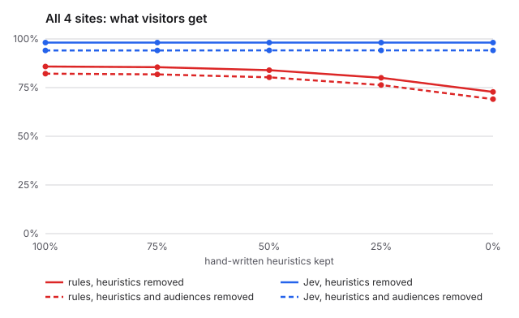
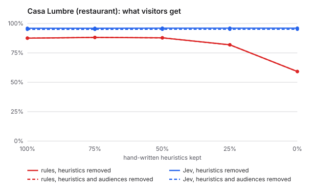
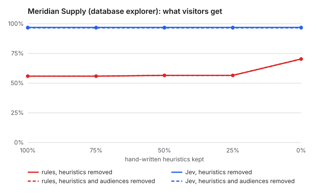
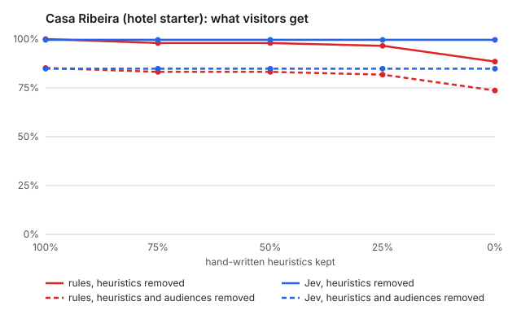
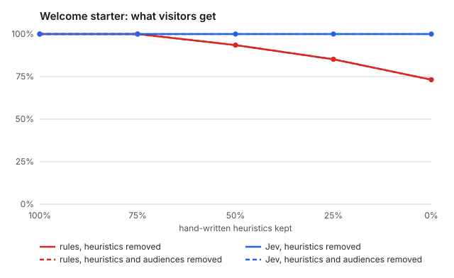

# Heuristic ablation: descriptions vs hand-written rules

Generated 2026-10-01T11:46:46.622Z · engine jev-1.13.0 · seed 7 · Jev spent on recordings $0.68 (16,177,920 input tokens; this run $0.000)

## Verdict

**not-shown.** The pre-registered conditions are not met: gap without heuristics or audiences 25.0 points (needs >= 10); gap without heuristics 25.4 points; Jev invariants below 99% at 0% without audiences on explorer (65.2%), hotel (97.7%). Lead with cost, safety and explainability.

- Gap with heuristics removed (audiences kept), at 0%: 25.4 points
- Gap with heuristics and audiences removed, at 0%: 25.0 points
- Jev invariant pass rate at 0% without audiences: restaurant 99.6%, explorer 65.2%, hotel 97.7%, welcome 100.0%

Rules fixed before the data was seen: gap = mean over sites, at 0% kept, of Jev's minus the rules' pooled decision accuracy. holds: gap(ha) >= 10 points and Jev invariants >= 99% on every site at 0% ha; holds-partially: gap(h) >= 10 points while gap(ha) < 10 points; otherwise not-shown.

## Method

- **Two arms.** *Heuristics removed*: each site's hand-written heuristics are kept at 100%, 75%, 50%, 25% and 0%. *Heuristics and audiences removed*: the same, with every `audience` also removed. Descriptions (`what`, `not_for`, tags), defaults and business invariants (`mustInclude` / `mustExclude`) stay in both.
- **Seeded, nested removal.** Heuristics are dropped in an order fixed by seed 7; a heuristic kept at 25% is kept at every higher level. The restaurant is repeated with seed 1009.
- **Record once, replay.** Heuristics never reach the model, so within an arm Jev answers the same questions at every level. Jev is recorded once per site and arm (3 repeats) and replayed for every level.
- **Measurements.** *Raw accuracy*: labelled answers vs accepted values. *Decision accuracy*: labels scored against the final page after gating, defaults, invariants and fallbacks (what a visitor gets; for Jev this includes its rules fallback for uncalibrated kinds). *Invariants*: page properties every plan must satisfy.

## Situation space

| site | buckets | situations | fixtures | situations covered | sources | heuristics | audiences | description chars | naive rules for full coverage |
|---|---|---|---|---|---|---|---|---|---|
| restaurant | 8 | 6,480 | 164 | 164 | 9 | 30 | 2 | 986 | 291,600 |
| explorer | 6 | 432 | 113 | 7 | 10 | 19 | 1 | 1,199 | 21,600 |
| hotel | 9 | 12,960 | 105 | 98 | 10 | 11 | 9 | 972 | 648,000 |
| welcome | 6 | 288 | 27 | 24 | 6 | 4 | 3 | 584 | 8,640 |

Situations are the product of declared labels per bucket (`language`: the languages the fixtures use); `unknown` is not counted, so this is a lower bound. Naive rules = situations × sources × 5 decisions.

## Casa Lumbre (restaurant)

### heuristics removed

| kept | engine | relevance (raw) | relevance (decision) | all decisions | invariants |
|---|---|---|---|---|---|
| 100% | rules | 94.2% | 94.9% | 87.5% | 100.0% |
| 100% | jev-1.13.0 | 100.0% | 100.0% | 95.9% | 100.0% |
| 75% | rules | 94.2% | 94.9% | 88.1% | 88.9% |
| 75% | jev-1.13.0 | 100.0% | 100.0% | 95.9% | 100.0% |
| 50% | rules | 94.2% | 94.9% | 87.8% | 88.9% |
| 50% | jev-1.13.0 | 100.0% | 100.0% | 96.0% | 100.0% |
| 25% | rules | 85.8% | 87.7% | 81.9% | 88.9% |
| 25% | jev-1.13.0 | 100.0% | 100.0% | 96.0% | 100.0% |
| 0% | rules | 74.1% | 77.5% | 59.2% | 88.2% |
| 0% | jev-1.13.0 | 100.0% | 100.0% | 96.0% | 99.6% |

Invariant failures at 0% (rules):

- `tourist-insta`: hero is empty
- `local-maps`: hero is empty
- `local-maps`: lunch-menu missing
- `local-maps`: lunch-menu@- vs dinner-menu@1
- `regular-desktop`: hero is empty
- `regular-desktop`: lunch-menu missing
- `late-night-closed`: hero is empty
- `arrival=instagram,time=13:10,distance=1.2km,device=desktop,visits=returning,lang=en`: lunch-menu missing
- … 25 more

Invariant failures at 0% (jev-1.13.0):

- `regular-desktop`: hero is lunch-menu

### heuristics and audiences removed

| kept | engine | relevance (raw) | relevance (decision) | all decisions | invariants |
|---|---|---|---|---|---|
| 100% | rules | 94.2% | 94.9% | 87.5% | 100.0% |
| 100% | jev-1.13.0 | 99.2% | 98.9% | 95.0% | 99.6% |
| 75% | rules | 94.2% | 94.9% | 88.1% | 88.9% |
| 75% | jev-1.13.0 | 99.2% | 98.9% | 95.0% | 100.0% |
| 50% | rules | 94.2% | 94.9% | 87.8% | 88.9% |
| 50% | jev-1.13.0 | 99.2% | 98.9% | 95.1% | 100.0% |
| 25% | rules | 85.8% | 87.7% | 81.9% | 88.9% |
| 25% | jev-1.13.0 | 99.2% | 98.9% | 95.1% | 100.0% |
| 0% | rules | 74.1% | 77.5% | 59.2% | 88.2% |
| 0% | jev-1.13.0 | 99.2% | 98.9% | 95.1% | 99.6% |

Invariant failures at 0% (rules):

- `tourist-insta`: hero is empty
- `local-maps`: hero is empty
- `local-maps`: lunch-menu missing
- `local-maps`: lunch-menu@- vs dinner-menu@1
- `regular-desktop`: hero is empty
- `regular-desktop`: lunch-menu missing
- `late-night-closed`: hero is empty
- `arrival=instagram,time=13:10,distance=1.2km,device=desktop,visits=returning,lang=en`: lunch-menu missing
- … 25 more

Invariant failures at 0% (jev-1.13.0):

- `regular-desktop`: hero is lunch-menu

### Robustness: seed 1009

heuristics removed:

| kept | engine | relevance (raw) | relevance (decision) | all decisions | invariants |
|---|---|---|---|---|---|
| 100% | rules | 94.2% | 94.9% | 87.5% | 100.0% |
| 100% | jev-1.13.0 | 100.0% | 100.0% | 95.9% | 100.0% |
| 75% | rules | 77.5% | 80.4% | 81.1% | 99.6% |
| 75% | jev-1.13.0 | 100.0% | 100.0% | 96.0% | 99.6% |
| 50% | rules | 77.5% | 80.4% | 74.2% | 99.3% |
| 50% | jev-1.13.0 | 100.0% | 100.0% | 96.0% | 99.6% |
| 25% | rules | 80.0% | 82.6% | 80.3% | 99.3% |
| 25% | jev-1.13.0 | 100.0% | 100.0% | 96.0% | 99.6% |
| 0% | rules | 74.1% | 77.5% | 59.2% | 88.2% |
| 0% | jev-1.13.0 | 100.0% | 100.0% | 96.0% | 99.6% |

heuristics and audiences removed:

| kept | engine | relevance (raw) | relevance (decision) | all decisions | invariants |
|---|---|---|---|---|---|
| 100% | rules | 94.2% | 94.9% | 87.5% | 100.0% |
| 100% | jev-1.13.0 | 99.2% | 98.9% | 95.0% | 99.6% |
| 75% | rules | 77.5% | 80.4% | 81.1% | 99.6% |
| 75% | jev-1.13.0 | 99.2% | 98.9% | 95.1% | 99.6% |
| 50% | rules | 77.5% | 80.4% | 74.2% | 99.3% |
| 50% | jev-1.13.0 | 99.2% | 98.9% | 95.1% | 99.6% |
| 25% | rules | 80.0% | 82.6% | 80.3% | 99.3% |
| 25% | jev-1.13.0 | 99.2% | 98.9% | 95.1% | 99.6% |
| 0% | rules | 74.1% | 77.5% | 59.2% | 88.2% |
| 0% | jev-1.13.0 | 99.2% | 98.9% | 95.1% | 99.6% |

## Meridian Supply (database explorer)

### heuristics removed

| kept | engine | relevance (raw) | relevance (decision) | all decisions | invariants |
|---|---|---|---|---|---|
| 100% | rules | 55.9% | 55.9% | 55.9% | 100.0% |
| 100% | jev-1.13.0 | 96.3% | 96.9% | 96.9% | 100.0% |
| 75% | rules | 55.9% | 55.9% | 55.9% | 87.0% |
| 75% | jev-1.13.0 | 96.3% | 96.9% | 96.9% | 87.0% |
| 50% | rules | 56.6% | 56.6% | 56.6% | 73.9% |
| 50% | jev-1.13.0 | 96.3% | 96.9% | 96.9% | 73.9% |
| 25% | rules | 56.6% | 56.6% | 56.6% | 60.9% |
| 25% | jev-1.13.0 | 96.3% | 96.9% | 96.9% | 73.9% |
| 0% | rules | 70.3% | 70.3% | 70.3% | 60.9% |
| 0% | jev-1.13.0 | 96.3% | 96.9% | 96.9% | 73.9% |

Invariant failures at 0% (rules):

- `ops-manager-monday`: hero is empty
- `executive-mobile`: hero is empty
- `executive-mobile`: inventory-risk present in secondary
- `role=ops-manager,device=desktop`: hero is empty
- `role=ops-manager,device=mobile`: hero is empty
- `role=executive,device=desktop`: hero is empty
- `role=executive,device=desktop`: inventory-risk present in aside
- `role=executive,device=mobile`: hero is empty
- … 1 more

Invariant failures at 0% (jev-1.13.0):

- `ops-manager-monday`: hero is empty
- `executive-mobile`: hero is empty
- `role=ops-manager,device=desktop`: hero is empty
- `role=ops-manager,device=mobile`: hero is empty
- `role=executive,device=desktop`: hero is empty
- `role=executive,device=mobile`: hero is empty

### heuristics and audiences removed

| kept | engine | relevance (raw) | relevance (decision) | all decisions | invariants |
|---|---|---|---|---|---|
| 100% | rules | 55.9% | 55.9% | 55.9% | 100.0% |
| 100% | jev-1.13.0 | 96.6% | 96.6% | 96.6% | 91.3% |
| 75% | rules | 55.9% | 55.9% | 55.9% | 87.0% |
| 75% | jev-1.13.0 | 96.6% | 96.6% | 96.6% | 78.3% |
| 50% | rules | 56.6% | 56.6% | 56.6% | 73.9% |
| 50% | jev-1.13.0 | 96.6% | 96.6% | 96.6% | 65.2% |
| 25% | rules | 56.6% | 56.6% | 56.6% | 60.9% |
| 25% | jev-1.13.0 | 96.6% | 96.6% | 96.6% | 65.2% |
| 0% | rules | 70.3% | 70.3% | 70.3% | 60.9% |
| 0% | jev-1.13.0 | 96.6% | 96.6% | 96.6% | 65.2% |

Invariant failures at 0% (rules):

- `ops-manager-monday`: hero is empty
- `executive-mobile`: hero is empty
- `executive-mobile`: inventory-risk present in secondary
- `role=ops-manager,device=desktop`: hero is empty
- `role=ops-manager,device=mobile`: hero is empty
- `role=executive,device=desktop`: hero is empty
- `role=executive,device=desktop`: inventory-risk present in aside
- `role=executive,device=mobile`: hero is empty
- … 1 more

Invariant failures at 0% (jev-1.13.0):

- `ops-manager-monday`: hero is empty
- `ops-manager-monday`: briefing present in secondary
- `executive-mobile`: hero is empty
- `role=ops-manager,device=desktop`: hero is empty
- `role=ops-manager,device=desktop`: briefing present in secondary
- `role=ops-manager,device=mobile`: hero is empty
- `role=executive,device=desktop`: hero is empty
- `role=executive,device=mobile`: hero is empty

## Casa Ribeira (hotel starter)

### heuristics removed

| kept | engine | relevance (raw) | relevance (decision) | all decisions | invariants |
|---|---|---|---|---|---|
| 100% | rules | 100.0% | 100.0% | 100.0% | 100.0% |
| 100% | jev-1.13.0 | 100.0% | 100.0% | 99.6% | 100.0% |
| 75% | rules | 97.6% | 97.8% | 98.0% | 99.4% |
| 75% | jev-1.13.0 | 100.0% | 100.0% | 99.6% | 100.0% |
| 50% | rules | 97.6% | 97.8% | 98.0% | 99.4% |
| 50% | jev-1.13.0 | 100.0% | 100.0% | 99.6% | 100.0% |
| 25% | rules | 97.6% | 97.8% | 96.6% | 99.4% |
| 25% | jev-1.13.0 | 100.0% | 100.0% | 99.6% | 100.0% |
| 0% | rules | 86.3% | 89.2% | 88.5% | 98.2% |
| 0% | jev-1.13.0 | 100.0% | 100.0% | 99.6% | 99.4% |

Invariant failures at 0% (rules):

- `in-house-morning`: hero is empty
- `in-house-morning`: breakfast missing
- `in-house-rainy-evening`: today missing

Invariant failures at 0% (jev-1.13.0):

- `in-house-morning`: hero is empty

### heuristics and audiences removed

| kept | engine | relevance (raw) | relevance (decision) | all decisions | invariants |
|---|---|---|---|---|---|
| 100% | rules | 82.4% | 84.2% | 85.2% | 97.7% |
| 100% | jev-1.13.0 | 72.8% | 83.8% | 84.8% | 97.7% |
| 75% | rules | 80.0% | 82.0% | 83.2% | 97.1% |
| 75% | jev-1.13.0 | 72.8% | 83.8% | 84.8% | 97.7% |
| 50% | rules | 80.0% | 82.0% | 83.2% | 97.1% |
| 50% | jev-1.13.0 | 72.8% | 83.8% | 84.8% | 97.7% |
| 25% | rules | 80.0% | 82.0% | 81.8% | 97.1% |
| 25% | jev-1.13.0 | 72.8% | 83.8% | 84.8% | 97.7% |
| 0% | rules | 68.7% | 73.4% | 73.7% | 96.5% |
| 0% | jev-1.13.0 | 72.8% | 83.8% | 84.8% | 97.7% |

Invariant failures at 0% (rules):

- `arriving-today`: reviews present in secondary
- `in-house-morning`: hero is hero-photos
- `in-house-morning`: breakfast missing
- `in-house-morning`: offer present in primary
- `in-house-rainy-evening`: today missing
- `in-house-rainy-evening`: hero-photos present in hero

Invariant failures at 0% (jev-1.13.0):

- `arriving-today`: reviews present in secondary
- `in-house-morning`: hero is hero-photos
- `in-house-morning`: offer present in primary
- `in-house-rainy-evening`: hero-photos present in hero

## Welcome starter

### heuristics removed

| kept | engine | relevance (raw) | relevance (decision) | all decisions | invariants |
|---|---|---|---|---|---|
| 100% | rules | 100.0% | 100.0% | 100.0% | 100.0% |
| 100% | jev-1.13.0 | 100.0% | 100.0% | 100.0% | 100.0% |
| 75% | rules | 100.0% | 100.0% | 100.0% | 100.0% |
| 75% | jev-1.13.0 | 100.0% | 100.0% | 100.0% | 100.0% |
| 50% | rules | 93.5% | 93.5% | 93.5% | 98.8% |
| 50% | jev-1.13.0 | 100.0% | 100.0% | 100.0% | 100.0% |
| 25% | rules | 85.2% | 85.2% | 85.2% | 97.7% |
| 25% | jev-1.13.0 | 100.0% | 100.0% | 100.0% | 100.0% |
| 0% | rules | 73.1% | 73.1% | 73.1% | 96.5% |
| 0% | jev-1.13.0 | 100.0% | 100.0% | 100.0% | 100.0% |

Invariant failures at 0% (rules):

- `from-instagram`: from-social missing
- `from-instagram`: on-mobile missing
- `night-owl`: late-night missing

### heuristics and audiences removed

| kept | engine | relevance (raw) | relevance (decision) | all decisions | invariants |
|---|---|---|---|---|---|
| 100% | rules | 100.0% | 100.0% | 100.0% | 100.0% |
| 100% | jev-1.13.0 | 93.5% | 100.0% | 100.0% | 100.0% |
| 75% | rules | 100.0% | 100.0% | 100.0% | 100.0% |
| 75% | jev-1.13.0 | 93.5% | 100.0% | 100.0% | 100.0% |
| 50% | rules | 93.5% | 93.5% | 93.5% | 98.8% |
| 50% | jev-1.13.0 | 93.5% | 100.0% | 100.0% | 100.0% |
| 25% | rules | 85.2% | 85.2% | 85.2% | 97.7% |
| 25% | jev-1.13.0 | 93.5% | 100.0% | 100.0% | 100.0% |
| 0% | rules | 73.1% | 73.1% | 73.1% | 96.5% |
| 0% | jev-1.13.0 | 93.5% | 100.0% | 100.0% | 100.0% |

Invariant failures at 0% (rules):

- `from-instagram`: from-social missing
- `from-instagram`: on-mobile missing
- `night-owl`: late-night missing

